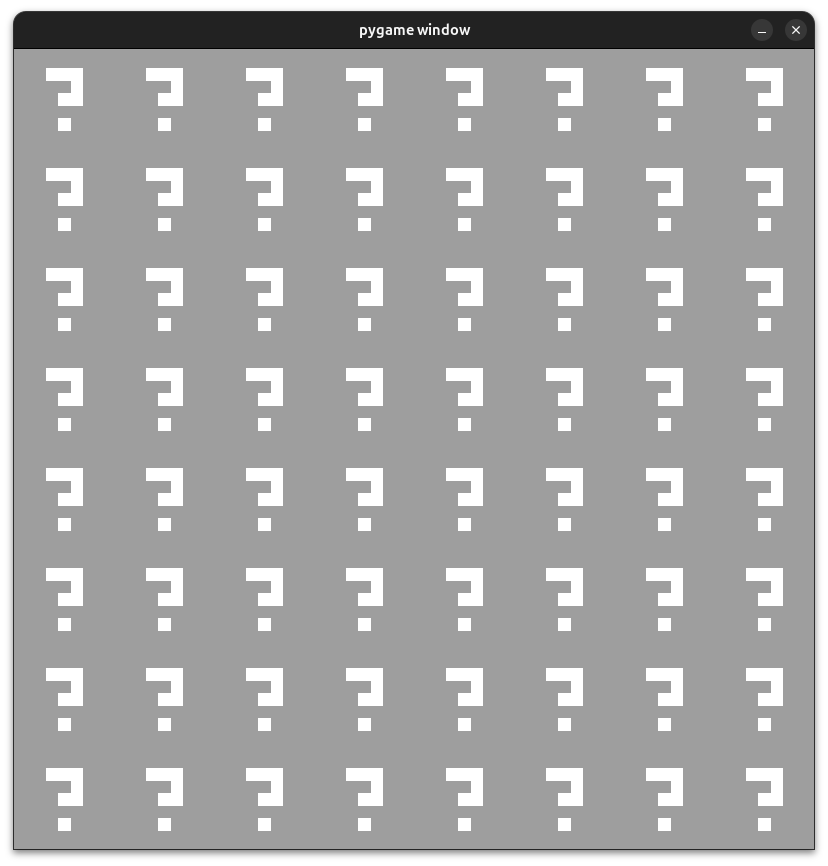
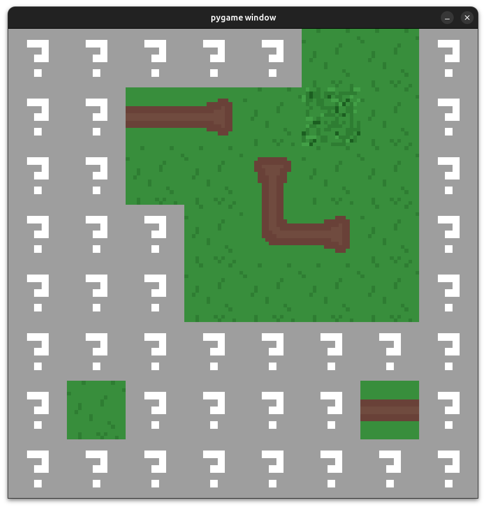
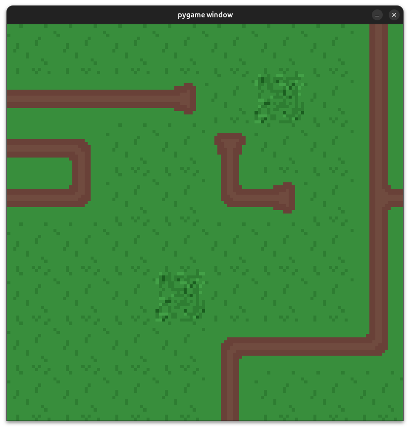
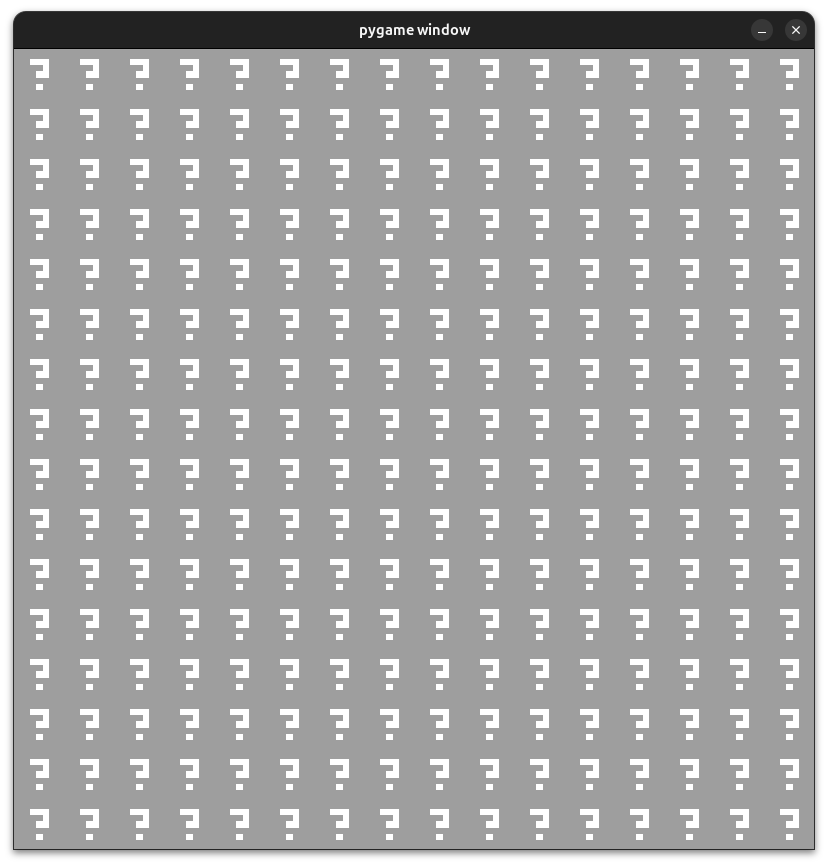
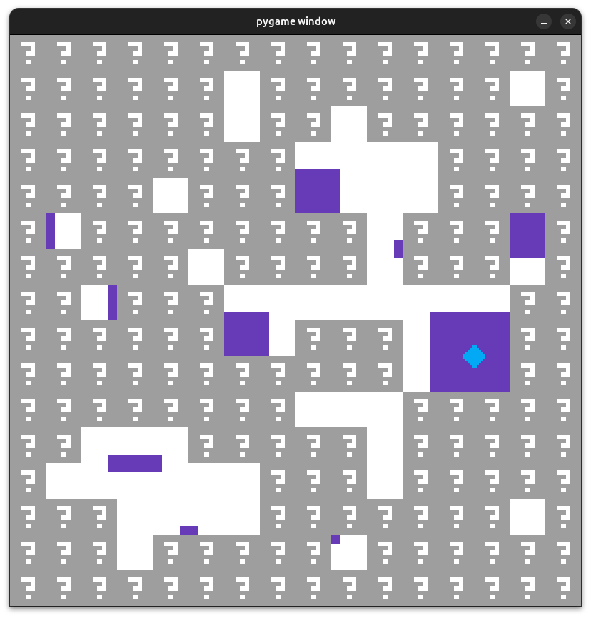
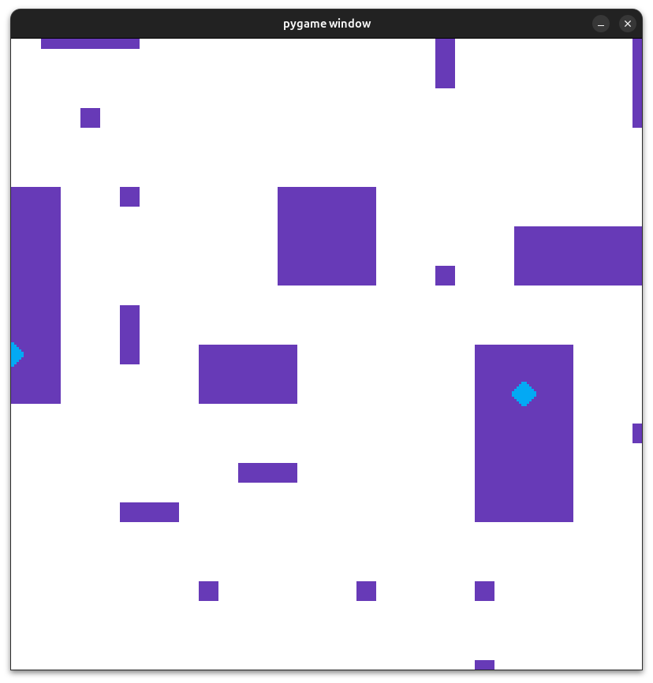

# wfc | Wave Function Collapse

`wfc` is a Python implementation of the Wave Function Collapse algorithm.
It also comes with a basic GUI for displaying 2D grids of tiles, and a rule parser for providing tile-socket rules via YAML.









## What is Wave Function Collapse?

I recommend [this article by Robert Heaton](https://robertheaton.com/2018/12/17/wavefunction-collapse-algorithm/) as a starting point.

Wave Function Collapse (WFC) is about taking a collection of nodes that can take many possible values,
and "collapsing" the possibilities of each node down into a single known value, based on the values of all other nodes.
Typically WFC is applied to 2D and 3D grids (as seen in this repository), but the raw algorithm can be applied to more abstract graphing models.

## How to run wfc

### Environment setup

```bash
python3 -m venv venv
source venv/bin/activate
pip install -U pip
pip install -r requirements.txt
```

### Run wfc

```bash
python3 main.py -r your_rules.yaml
```

Some example rules are provided in the `examples/` directory. Try the following:

- `python3 main.py -r examples/abstract/abstract.yaml`
- `python3 main.py -r examples/grassy_roads/grassy_roads.yaml`

### Using wfc

When the grid first loads, all grid cells start at maximum entropy (any cell can become any tile from the ruleset).
From here, you can do a few things:

- `Left Click`: Clicking on a cell will collapse that cell into a single tile, randomly choosing from one of its remaining tile possibilities.
- `<Space> button`: Collapse one cell with the lowest entropy.
- `<G> button`: G for "Go". Start collapsing cells randomly over time, always collapsing the cell that has the lowest entropy first. Press `G` again to stop.
- `<Enter> button`: Collapse all cells in the grid immediately.

### Run the unit tests

```bash
pytest
```

## Rules via YAML

See the YAML files in the `examples/` folder as a useful reference.

wfc uses the concept of "sockets" and "tiles". Tiles can connect to other tiles next to them if they share a common socket.
Imagine puzzle pieces - two pieces will only fit next to each other if they have the right connection between them.
This is the core of how wfc works. If a cell collapses to a single tile type, then it restricts which tile types can be put next to it.

Sockets can be symmetric or asymmetric.
Symmetric sockets can only connect to themselves, whereas asymmetric sockets can only connect to a specific counterpart.

## Additional Reading

https://christianjmills.com/posts/wave-function-collapse-for-3d-notes/index.html
